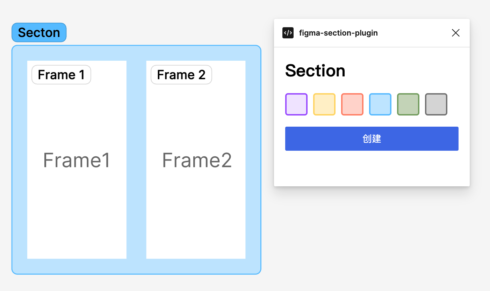

# Figma Section

Free Frame management plugin, quickly group frames and manage them efficiently.

免费的 Frame 管理插件，可以快速地对 Frame 进行分组，高效管理。

[插件主页](https://www.figma.com/community/plugin/1113886515472528766/)

## How to use / 使用方式

After selecting multiple Frames, run the plugin, and then create a Section. You can also quickly mark Sections with different colors.

选中多个 Frame 后，运行插件，然后创建 Section。还可以为 Section 快速标记不同的颜色。

## Screenshot

## 更新记录

## v1.0.3

Adapt to dark mode.

适配黑暗模式。

## v1.0.2

Fixed bugs.

修复了 section 大小不对的问题。
